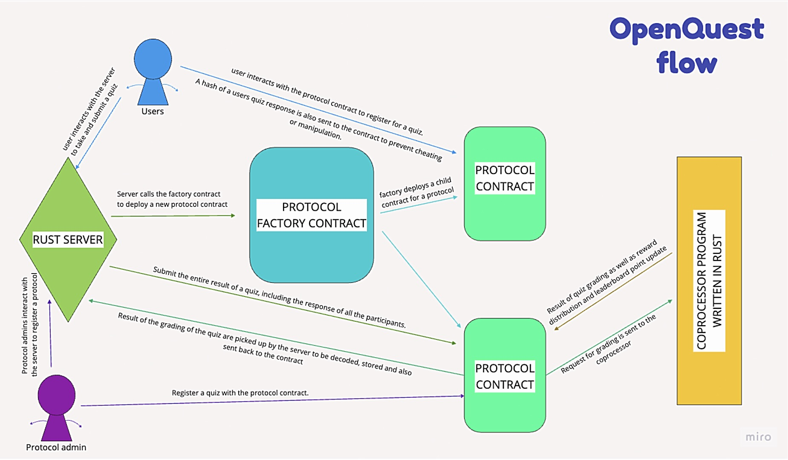

 

    

 

    <i>OpenQuest Protocol</i>

<b>Experiment week #3 (Cartesi X EigenLayer) </b>

 

	
	

# OpenQuest

OpenQuest is a platform that helps blockchain projects track, engage, and grow their communities through fun and interactive Quests.

## 🚀 The Problem OpenQuest Solves

Tokens are often misallocated to airdrop hunters, while projects struggle to drive genuine participation and sustainable growth in their ecosystems. Many projects also lack reliable ways to track contributor engagement, making it difficult to host provable and efficiently gated events like hackathons or grants.

OpenQuest solves this by enabling projects to:

- **Engage their communities**
- **Foster growth**
- **Reward meaningful contributions** through verifiable Quests.

With a leaderboard system, projects gain solid, verifiable metrics on contributors, helping protocols identify engagement trends and take action when contributors lose interest.

---

## Architecture

---

## 🛠️ How OpenQuest Works

- **Personalized Account/Contracts:** Protocols register on OpenQuest, deploying dedicated smart contracts for seamless Quest management.
- **Permissionless & No-Code Deployment:** Launch customizable, verifiable Quests without approvals or coding.
- **Trustless Verification & Fair Scoring:** Powered by Cartesi’s Coprocessor for deterministic grading.
- **Automated Rewards & Incentive Pools:** Distribute rewards automatically based on participation and leaderboard rankings.
- **Leaderboard & Onchain Reputation:** Track developer contributions and community engagement, with NFTs as proof of participation.

---

## 🔮 Future Implementations

- AI integration for meme and technical writing contests.
- Hackathon support with improved interface and flow.
- Social scanner integration for content creator rewards.

---

## 🧰 Technologies Used

Cartesi, EigenLayer, Next.js, Rust, Actix-web, Solidity

---

## 🔗 Links

- **Website:** [OpenQuest](https://github.com/Nonnyjoe/OpenQuest)
- **GitHub:** [OpenQuest Repository](https://github.com/Nonnyjoe/OpenQuest)
- **Solidity Contracts:**
  - [Contract 1](https://holesky.etherscan.io/address/0x78f7ddbb09d77f08b8e6a3df94e79fe606966d82)
  - [Contract 2](https://holesky.etherscan.io/address/0x4f26fc61dA4Ac6B8030F4178A9800ee40f9eDE38)

---

### Made with ❤️ by the OpenQuest Team.
